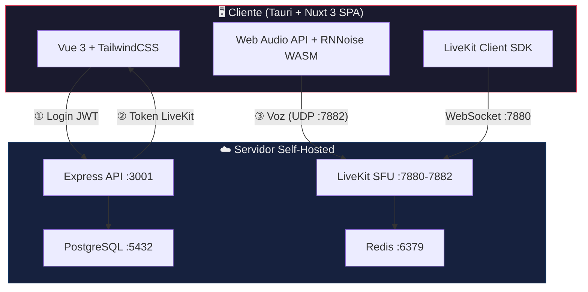

# 🎙️ SCPeak

<div align="center">

**Comunicación por voz al estilo Walkie-Talkie para Star Citizen**

[](https://github.com/ArticSeths/scpeak/actions/workflows/ci.yml)
[](https://github.com/ArticSeths/scpeak/releases)
[](https://github.com/ArticSeths/scpeak/pkgs/container/scpeak-server)
[](https://pnpm.io)
[](https://www.typescriptlang.org)

</div>

---

## 📡 ¿Qué es SCPeak?

SCPeak es una aplicación de escritorio **nativa, ultraligera y de alta capacidad** para comunicación por voz en tiempo real. Diseñada para integrarse con Star Citizen, soporta **más de 100 usuarios simultáneos por sala** con efectos de voz personalizados, cancelación de ruido por IA y despliegue simplificado vía Docker.

| Característica | Detalle |
|---|---|
| 🪶 **Ligera** | App nativa de 5-10 MB con Tauri |
| 🔊 **Walkie-Talkie** | Filtros pasa-banda y distorsión vía Web Audio API |
| 🤖 **IA** | Cancelación de ruido RNNoise por WebAssembly |
| 🚀 **100+ usuarios/sala** | LiveKit SFU con Opus DTX |
| 🐳 **Self-Hosted** | Despliegue en 1 minuto con Docker Compose |
| 🔐 **JWT + LiveKit tokens** | Autenticación delegada sin exponer claves |

---

## 🏗️ Arquitectura



### Flujo de conexión

1. **Login** → El cliente se autentica contra la API Express y recibe un JWT de sesión.
2. **Join Room** → Envía el JWT para solicitar acceso a una sala. La API valida permisos.
3. **Token LiveKit** → La API genera un token firmado con permisos limitados (sala, canPublish).
4. **Transmisión** → El cliente usa el token para conectarse directamente al SFU por un único puerto UDP.

---

## 🧰 Stack Tecnológico

| Capa | Tecnología |
|---|---|
| **App nativa** | [Tauri 2](https://tauri.app) (Rust) |
| **Frontend** | [Nuxt 3](https://nuxt.com) (SPA) + [Vue 3](https://vuejs.org) + [TailwindCSS](https://tailwindcss.com) |
| **Backend** | [Express 5](https://expressjs.com) + [Drizzle ORM](https://orm.drizzle.team) |
| **Voz** | [LiveKit](https://livekit.io) (SFU open-source) |
| **Base de datos** | PostgreSQL 15 |
| **Cache** | Redis 7 |
| **Lenguaje** | TypeScript en todo el monorepo |
| **Empaquetado** | pnpm workspaces + Docker |

---

## 📁 Estructura del Monorepo

```
scpeak/
├── apps/
│   ├── client/               # Nuxt 3 SPA + Tauri
│   │   ├── pages/            # Rutas (index, rooms, room)
│   │   ├── composables/      # useLiveKit, useAudioDevices, useAudioEffects
│   │   ├── middleware/        # auth.ts
│   │   └── src-tauri/        # Código Rust + config Tauri
│   └── server/               # Express API
│       └── src/
│           ├── routes/        # auth.ts, rooms.ts
│           ├── middleware/     # auth.ts (JWT)
│           ├── services/      # livekit.ts (token generation)
│           └── db/            # schema.ts, index.ts
├── packages/
│   └── shared/               # Tipos TypeScript compartidos
├── docker-compose.yml        # Infraestructura de desarrollo
├── docker-compose.prod.yml   # Despliegue de producción
├── Dockerfile                # Imagen del servidor
└── .github/workflows/        # CI/CD
```

---

## 🚀 Desarrollo Local

### Requisitos

- [Node.js 22+](https://nodejs.org)
- [pnpm](https://pnpm.io) (`corepack enable`)
- [Docker](https://docker.com) (para la infraestructura)

### Setup rápido

```bash
# 1. Clonar
git clone https://github.com/ArticSeths/scpeak.git
cd scpeak

# 2. Instalar dependencias
pnpm install

# 3. Configurar variables de entorno
cp .env.example .env
# Edita .env con tus claves (genera secretos con: openssl rand -hex 32)

# 4. Levantar infraestructura (LiveKit + PostgreSQL + Redis)
pnpm dev:infra

# 5. Iniciar todo (infra + server + client)
pnpm dev
```

### Comandos útiles

| Comando | Descripción |
|---|---|
| `pnpm dev` | Infra + server + client en paralelo |
| `pnpm dev:server` | Solo backend (`:3001`) |
| `pnpm dev:client` | Solo frontend (`:3000`) |
| `pnpm tauri:dev` | App nativa Tauri |
| `pnpm check` | Lint + typecheck + tests |
| `pnpm lint` | ESLint |
| `pnpm test` | Tests (Vitest) |
| `pnpm db:push` | Push schema a PostgreSQL |

---

## 📦 Despliegue (Self-Hosted)

Despliega tu propio servidor SCPeak en **1 minuto** con Docker Compose.

### Requisitos del servidor

- Docker + Docker Compose
- Puertos abiertos: `3001/tcp`, `7880/tcp`, `7881/tcp`, `7882/udp`
- Mínimo 1 GB RAM, 2 vCPU

### Paso 1: Obtén los archivos

```bash
# Opción A: Solo los archivos de despliegue
wget https://raw.githubusercontent.com/ArticSeths/scpeak/master/docker-compose.prod.yml
wget https://raw.githubusercontent.com/ArticSeths/scpeak/master/.env.prod.example

# Opción B: Clonar todo el repo
git clone https://github.com/ArticSeths/scpeak.git
cd scpeak
```

### Paso 2: Configura tu servidor

```bash
cp .env.prod.example .env
nano .env  # O usa vim, code, etc.
```

Rellena **todos** los secretos con valores generados por `openssl rand -hex 32`:

```env
SERVER_NAME=Mi Servidor SCPeak
SERVER_PASSWORD=           # Déjalo vacío para acceso libre, o pon una contraseña

JWT_SECRET=<genera-con-openssl>
LIVEKIT_API_KEY=<genera-una-key>
LIVEKIT_API_SECRET=<genera-con-openssl>
POSTGRES_PASSWORD=<genera-contraseña-fuerte>
```

### Paso 3: Levanta los servicios

```bash
docker compose -f docker-compose.prod.yml up -d
```

Esto descarga automáticamente la imagen `ghcr.io/articseths/scpeak-server:latest` y levanta:

| Servicio | Puerto | Propósito |
|---|---|---|
| **scpeak-api** | `3001/tcp` | API REST (login, salas) |
| **livekit** | `7880/tcp` | Señalización WebSocket |
| **livekit** | `7881/tcp` | Fallback TCP |
| **livekit** | `7882/udp` | Voz (WebRTC) |
| **postgres** | — | Base de datos (interna) |
| **redis** | — | Cache LiveKit (interno) |

### Paso 4: Verifica

```bash
curl http://localhost:3001/info
# {"name":"Mi Servidor SCPeak","requiresPassword":false}
```

### Actualizar a una nueva versión

```bash
docker pull ghcr.io/articseths/scpeak-server:latest
docker compose -f docker-compose.prod.yml up -d --force-recreate
docker image prune -f
```

### Backup de la base de datos

```bash
docker compose -f docker-compose.prod.yml exec postgres \
  pg_dump -U admin sc_comms_db > backup_$(date +%Y%m%d).sql
```

> 📖 Guía completa en [`DEPLOY.md`](./DEPLOY.md)

---

## 🔄 CI/CD

El proyecto usa **GitHub Actions** para integración y entrega continua.

| Workflow | Disparador | Acción |
|---|---|---|
| **CI** | Push/PR a `master` | Lint → TypeCheck → Tests → Build Docker (seco) |
| **Release** | Tag `v*` | Build Docker + push a GHCR + Build Tauri (Win/Mac/Linux) + GitHub Release |

```bash
# Crear un release
git tag v1.0.0 && git push origin v1.0.0
```

### Imagen Docker publicada

```
ghcr.io/articseths/scpeak-server:latest
ghcr.io/articseths/scpeak-server:1.0.0
ghcr.io/articseths/scpeak-server:sha-xxxxxxx
```

---

## 🔐 Seguridad

- **JWT** con expiración de 7 días para sesiones de usuario.
- **LiveKit tokens** de corta duración generados por el servidor — los clientes nunca ven las API keys.
- **Contraseñas** hasheadas con bcrypt.
- **SERVER_PASSWORD** opcional para restringir el registro de nuevos usuarios.
- Puerto único UDP (`7882`) — minimiza la superficie de ataque y simplifica firewalls.

---

## 📄 Licencia

MIT © ArticSeths

